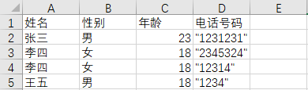

# split_frame_from_video

## 从视频中切分单帧图片
### 说明：
1. main.py：切分目录中所有视频
```bash
python main.py -videos_path "C:\Users\admin\Desktop" \
               -target_path "C:\Users\admin\Desktop\result" \
               -cut_start 10 \
               -cut_end 20
```
2. main_single.py: 切分单个视频
```bash
python main.py -videos_path "C:\Users\admin\Desktop\dog.avi" \
               -target_path "C:\Users\admin\Desktop\result" \
               -cut_start 10 \
               -cut_end 20
```

# excel合并相同行
1. excel.py
```bash
python excel.py "C:\Users\admin\Desktop\dog.csv" "C:\Users\admin\Desktop\result.csv"
```

2. demo
<p>

</p>